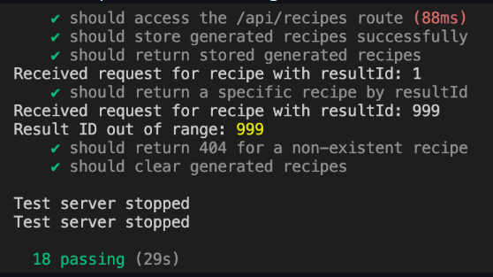
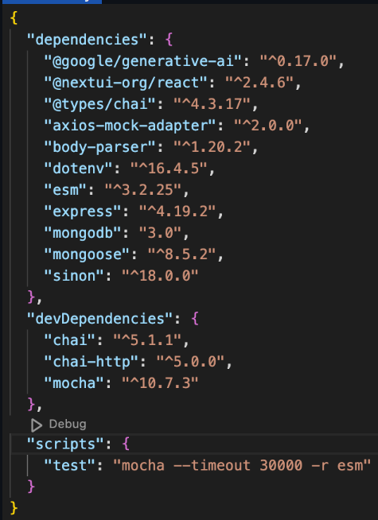

# MealMatch app
## About the project

Our project aims to tackle one of the world's greatest mysteries. What's for dinner tonight? A question that has stumped us all at one point or another. However, with the use of Artificial Intelligence and the abundance of recipes online, we have an idea for a solution, MealMatch. A mobile web-app which allows you to input the ingredients you have in your pantry, receiving back a detailed recipe outlining a meal best suited to you and your kitchen. With the ability to save recipes, you’ll be able to hold on to your favourite recipes and even plan out your recipes and groceries for the whole week. Print out a shopping list, share your favourite recipes, search for a related recipe, MealMatch will cover all your culinary needs in one space.


## Getting started

To correctly set up the application for viewing/contributions, follow the steps below.

1. Make a fork of the repository.
2. Clone the repository into your local machine.
3. Optionally, run the command `git remote add upstream https://github.com/SOFTENG-310-Group-7/Recipe-App/` to push and pull changes to/from the main repository. Keep in mind that all changes must be approved via a code review and pull request, as seen in [CONTRIBUTING.md](CONTRIBUTING.md) - *'How to Submit a Pull Request'*.

From here, the easiest way to deploy the app is to use the [Vercel Platform](https://vercel.com/new?utm_medium=default-template&filter=next.js&utm_source=create-next-app&utm_campaign=create-next-app-readme) from the creators of Next.js.

Please refer to [/frontend/README.md](/frontend/README.md) for further details on deploying the app.

# Built with

## Tech stack

**Frontend** - The front end was developed using a React and Next.js framework for the user interface.

**Backend** - Node.js with Express is used for backend logic such as authentication, storing user
data, and integrating with external APIs.

**Database** - MongoDB is used to store user and recipe data.

**Auth** - Auth0 is used for creating accounts.

**APIs** - Gemini API is used for retrieving AI generated recipes and Pexels API is used for generating images.

# Setup
Before using our application, make sure to follow the setup instructions below:

## API Setup

As explained, this application uses Gemini and Pexels to generate recipes and images. Below is an explanation if the setup needed to use these endpoints.

### Gemini
First you will need to setup an account with Google Gemini - you can do so [here](https://gemini.google.com/app)

1. Generate an [API key](https://ai.google.dev/gemini-api/docs/api-key) for Google Gemini

2. Under `server/config.env`replace the following field with your newly generated API key:
```
GEMINI_API_KEY=<your-api-key>
```
3. Save your changes and you're good to go!

### Pexels
First, you will need to set up an account with Pexels, you can do so [here](https://www.pexels.com/upload/)

1. Generate an [API Key](https://www.pexels.com/api/) for Pexels

2. Under `server/config.env`replace the following field with your newly generated API key:
```
PEXELS_API_KEY=<your-api-key>
```
3. Save your changes and you're good to go!

# Tests

To run tests To run the tests first install new dependencies and then run 'npm test' in the command line at the root of the project. You should see 18 tests passed, as in the image below.


If you get timeouts on the test, you can increase the specific timeout threshold in the outermost (project root) package.json (30000 ms currently).


# Usage

You are free to:
* Use the software for any purpose, whether personal, academic, or commercial.
* Modify the software to fit your needs or improve its functionality.
* Distribute copies of the software to others.
* Incorporate this software into your own projects, either in original or modified form.

## License

This project is licensed under the MIT License. For more details, please refer to the LICENSE file in the root directory of this repository.

## How to get help

For project-specific help, please email us at [softeng310group7@gmail.com](https://mail.google.com/mail/u/0/#inbox?compose=GTvVlcSDbhDtHkcglzPlSkQPbjKvpHgGKKKrHSMVnGrLPcptXFXRzSNbfTRwZMPmBKFQtpxBtzwpg). For git related help, please refer to the [github support](https://support.github.com/) 
page. For help with other frameworks, please visit the relevant website linked in [Acknowledgments](#acknowledgmenets).

## Acknowledgments
We would like to acknowledge the resources we utilised for this project:

- [React](https://react.dev/)
- [Next.js](https://nextjs.org/)
- [Node.js with express](https://expressjs.com/)
- [MongoDB](https://www.mongodb.com/)
- [Auth0](https://auth0.com/)
- [Gemini API](https://ai.google.dev/)
- [Pexels API](https://www.pexels.com/api/)
- [Vercel Platform](https://vercel.com/)
- [Chooase a license](https://choosealicense.com/)
- [Contributor Covenant](https://www.contributor-covenant.org)
- [ReadME template](https://github.com/othneildrew/Best-README-Template)
